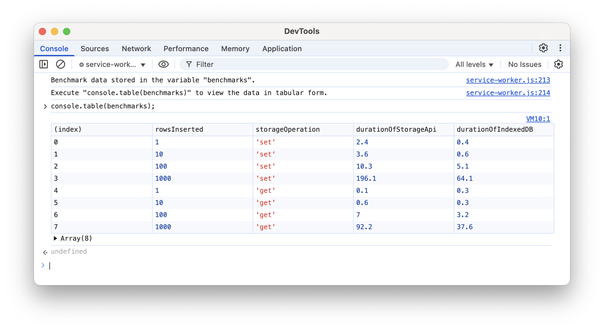

# Benchmarking Manifest V3 Storage Mechanisms

This is a **Manifest V3** web extension for the purpose of benchmarking the **chrome.storage.local** and **IndexedDB** storage mechanisms within a service worker.

Please install the unpacked extension in a Chromium browser.

The script will be executed automatically upon the initialization of the service worker and benchmarking data will be stored in the variable `benchmarks` using the following structure:

```
[
    {
        rowsInserted: number,
        operation: 'get' | 'set',
        storageApi: string,
        indexedDB: string,
    }
]
```

I recommend executing `console.table(benchmarks)` in DevTools to view the benchmarking data in tabular form:


